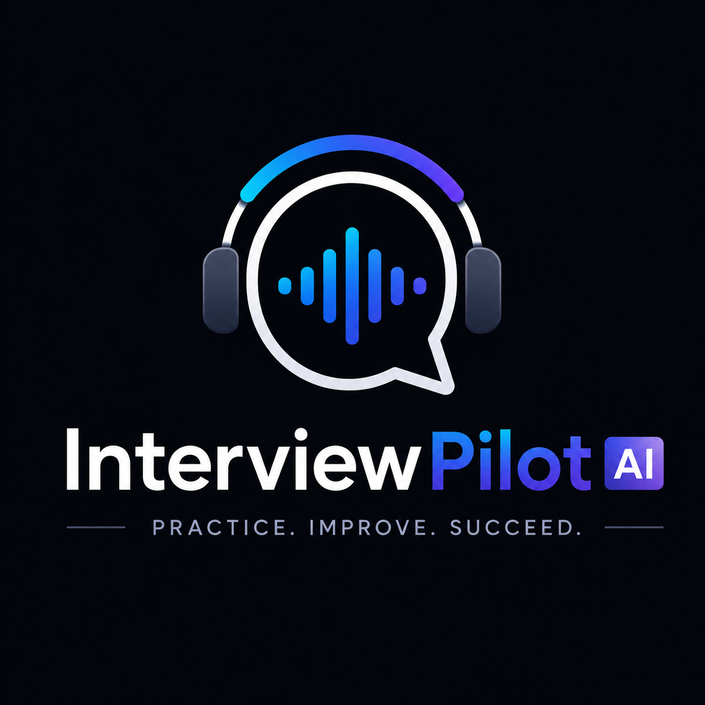
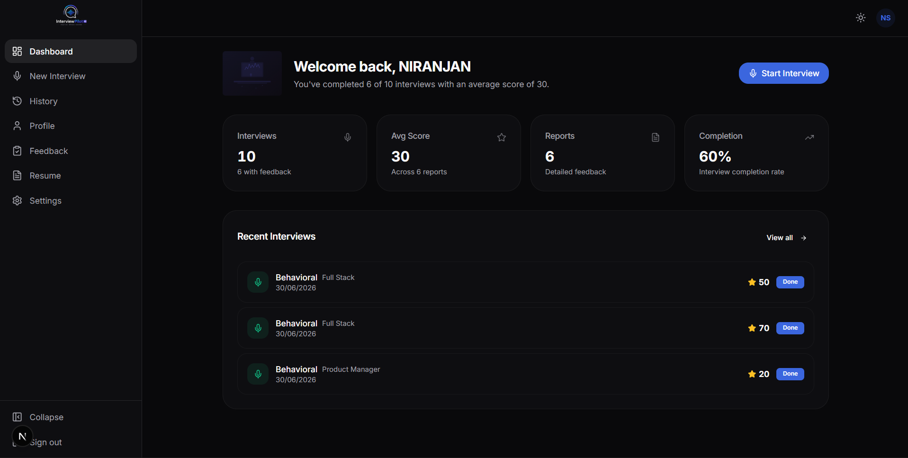
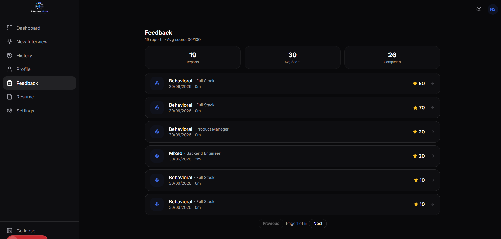
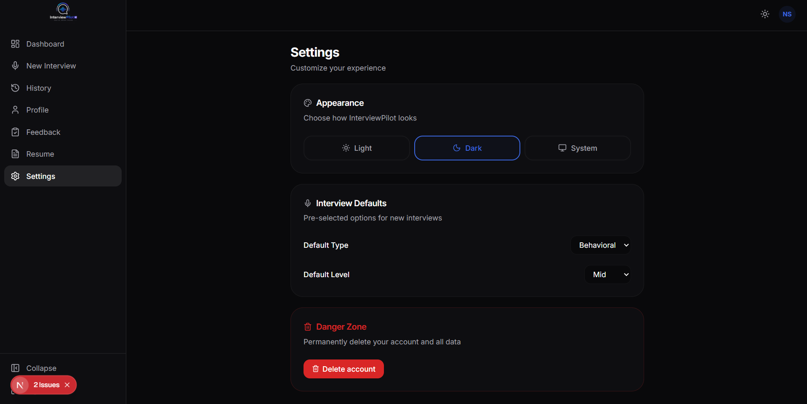
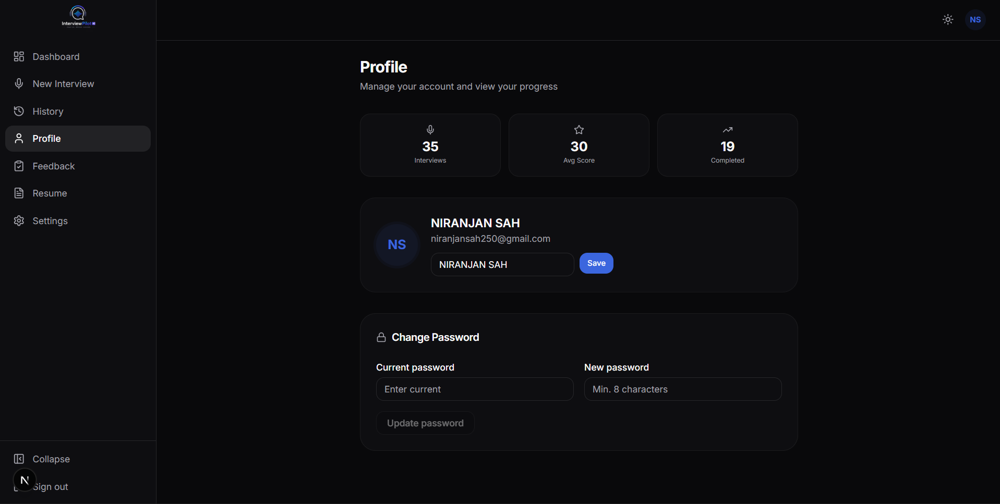
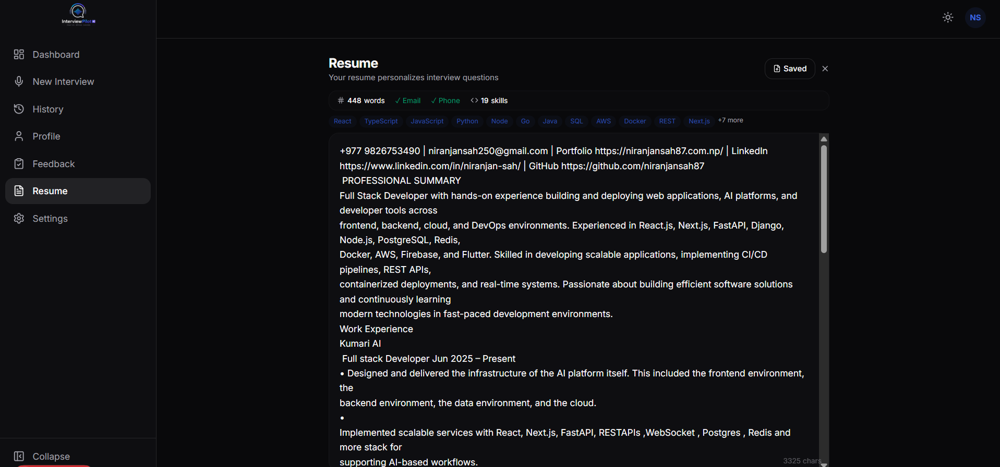

<p align="center">
  
</p>
<h1 align="center">InterviewPilot AI</h1>
<p align="center"><strong>AI-powered voice interviews that actually prepare you for the real thing.</strong></p>
<p align="center">
  <a href="https://interviewpilot.niranjansah87.com.np"><strong>Live Demo</strong></a> ·
  <a href="https://github.com/niranjansah87/interviewpilot-ai"><strong>GitHub</strong></a>
</p>
<p align="center">
  
  
  
  
  
  
  
</p>

---

## Overview

InterviewPilot AI is a production-grade voice interview platform. It simulates realistic technical and behavioral interviews using **ElevenLabs ConvAI** for natural speech, a **deterministic conversation engine** for adaptive follow-ups, and **GPT-4** for detailed feedback — backed by PostgreSQL, Redis, and a clean layered architecture.

Unlike static question banks, InterviewPilot:

- **Listens** to your actual spoken answers
- **Adapts** with contextual follow-up questions
- **Remembers** your resume, job description, and previous answers
- **Challenges** weak reasoning and probes trade-off decisions
- **Evaluates** with recruiter-quality feedback and scores

---

## Screenshots

### Dashboard & Setup

<p align="center">
  
  
</p>

### Interview Experience

<p align="center">
  
  
</p>

### Platform

<p align="center">
  
  
  
</p>

<p align="center">
  
  
</p>

---

## Key Features

### Voice AI
- **ElevenLabs ConvAI** (primary) with OpenAI Realtime fallback
- Real-time **Web Audio API** waveform visualization
- Voice Activity Detection with silence/speaking/loud states
- **Barge-in** — interrupt the AI mid-response
- Streaming transcript with speaker identification

### Conversation Engine
- **12-state deterministic machine** — no LLM owns the interview flow
- **8 interview types** — Behavioral, Technical, System Design, Frontend, Backend, Full-Stack, DevOps, Mixed
- **Adaptive difficulty** — scales from foundational to principal based on response quality
- **30+ follow-up styles** — never repeats phrasing
- **Context-aware** — uses resume, job description, and conversation history

### Feedback
- Overall score with Communication, Confidence, and Technical Reasoning breakdowns
- **Hiring recommendation** — Strong Hire / Hire / Lean Hire / No Hire
- Strengths, weaknesses, and actionable improvement plan
- GPT-4 powered analysis with transcript citations

### Platform
- JWT auth (15min access + 7d refresh) in httpOnly cookies
- bcrypt (cost 12) + CSRF + rate limiting
- PostgreSQL via Prisma ORM with Redis cache-aside
- Startup health checks for DB, Redis, OpenAI, and every ElevenLabs agent
- Dark mode, responsive, accessible

---

## Architecture

```
Browser (Web Audio API + WebSocket)
   │
   ├── getUserMedia → Shared AudioContext (16kHz)
   │   ├── AnalyserNode → VAD → Waveform
   │   └── ScriptProcessor → PCM16 → WebSocket
   │
   ▼
Next.js 16 App Router
   │
   ├── proxy.ts — Security headers, auth redirects
   ├── Route Handlers (/api/v1/*) — Zod validation
   ├── Service Layer — Auth + Interview
   ├── Repository Layer — Prisma with cache-aside
   │
   ├── AI Provider Abstraction
   │   ├── ElevenLabs ConvAI (primary)
   │   ├── OpenAI (fallback + feedback)
   │   └── Agent Pool — weighted random + circuit breaker
   │
   ├── Conversation Engine
   │   ├── State machine (12 states)
   │   ├── Context engine (profile, resume, JD, history)
   │   ├── Prompt engine (modular, 8 templates)
   │   └── Token manager (100K budget)
   │
   └── Monitoring — Pino + Startup health checks
```

---

## Tech Stack

| Category | Technology |
|---|---|
| Framework | Next.js 16, React 19, TypeScript |
| Styling | TailwindCSS, shadcn/ui, Framer Motion |
| Backend | Next.js Route Handlers |
| Database | PostgreSQL (Supabase) |
| ORM | Prisma 6 |
| Cache | Redis (ioredis) + Memory fallback |
| Voice AI | ElevenLabs ConvAI, OpenAI Realtime |
| Text AI | GPT-4 / GPT-4.1 |
| Auth | JWT (jose), bcrypt, SHA-256 |
| Validation | Zod v4 |
| Logging | Pino v10 |
| Deployment | Vercel |

---

## Interview Flow

```
Candidate → Setup → Resume Upload → Voice Session
    │
    ├── AI greets by name, references experience
    ├── Adaptive questions based on type, level, JD
    ├── Follow-ups probe depth, challenge reasoning
    ├── Barge-in for natural turn-taking
    ├── Live transcript streaming
    │
    ▼
Interview Ends → GPT-4 Feedback → Report → Dashboard
```

---

## Getting Started

```bash
git clone https://github.com/niranjansah87/interviewpilot-ai.git
cd interviewpilot-ai
pnpm install
cp .env.example .env.local
pnpm prisma migrate dev
pnpm dev
```

---

## Environment Variables

| Variable | Required | Description |
|---|---|---|
| `DATABASE_URL` | Yes | PostgreSQL connection (Supabase) |
| `JWT_SECRET` | Yes | Access token signing (min 32 chars) |
| `JWT_REFRESH_SECRET` | Yes | Refresh token signing (min 32 chars) |
| `OPENAI_API_KEY` | Yes | OpenAI API key |
| `NEXT_PUBLIC_APP_URL` | Yes | Application URL |
| `ELEVENLABS_API_KEY` | Voice | Primary ElevenLabs key |
| `ELEVENLABS_AGENT_ID` | Voice | Primary ConvAI agent |
| `ELEVENLABS_BACKUP_API_KEY` | Optional | Backup agent key |
| `ELEVENLABS_BACKUP_AGENT_ID` | Optional | Backup agent ID |
| `ELEVENLABS_EXTRA_API_KEY` | Optional | Extra agent key |
| `ELEVENLABS_EXTRA_AGENT_ID` | Optional | Extra agent ID |
| `REDIS_URL` | Optional | Redis connection |
| `CACHE_PROVIDER` | Optional | `redis` or `memory` (default) |

---

## Project Structure

```
src/
├── app/                     # Next.js App Router
│   ├── (auth)/              # Login, register
│   ├── (dashboard)/         # Protected routes
│   └── api/v1/              # REST API (auth, users, interviews, voice)
├── components/
│   ├── ui/                  # shadcn/ui components
│   └── features/            # Header, Sidebar, VoiceInterface
├── hooks/                   # useInterviewSession
├── lib/
│   ├── ai/                  # Provider abstraction, agent pool, adapters
│   ├── auth/                # JWT, bcrypt, cookies, CSRF
│   ├── conversation/        # Engine, context, prompts, token manager
│   ├── api/                 # Route helpers, rate limiting
│   └── audio/               # Shared AudioContext runtime
├── services/                # Auth + interview business logic
├── repositories/            # Prisma data access with cache-aside
├── cache/                   # CacheProvider, Redis, Memory
├── config/                  # Zod-validated environment
├── proxy.ts                 # Security headers + auth redirects
└── styles/                  # Design tokens (light + dark)
```

---

## Design Decisions

| Decision | Rationale |
|---|---|
| **Next.js App Router** | Server Components, Route Handlers, single deployment |
| **ElevenLabs ConvAI** | Production voice quality, WebSocket streaming, VAD built-in |
| **Provider abstraction** | Swap voice providers without touching application code |
| **Agent pool with circuit breaker** | Load-balance across 3 agents, auto-skip failed ones |
| **Shared AudioContext** | Single source for mic, VAD, and visualization — zero latency |
| **Prisma + PostgreSQL** | Type-safe queries, migrations, Supabase managed hosting |
| **Redis cache-aside** | Automatic memory fallback, no single point of failure |
| **Deterministic conversation engine** | LLM generates language, engine owns the interview flow |

---

## API Endpoints

| Method | Route | Description |
|---|---|---|
| `POST` | `/api/v1/auth/register` | Create account |
| `POST` | `/api/v1/auth/login` | Sign in |
| `POST` | `/api/v1/auth/logout` | Sign out |
| `POST` | `/api/v1/auth/refresh` | Refresh tokens |
| `GET` | `/api/v1/users/me` | Get profile |
| `PATCH` | `/api/v1/users/me/name` | Update name |
| `POST` | `/api/v1/users/me/password` | Change password |
| `POST` | `/api/v1/users/me/resume` | Upload resume |
| `GET` | `/api/v1/interviews` | List interviews |
| `POST` | `/api/v1/interviews` | Create interview |
| `GET` | `/api/v1/interviews/[id]` | Get interview |
| `PATCH` | `/api/v1/interviews/[id]` | Update status |
| `DELETE` | `/api/v1/interviews/[id]` | Delete interview |
| `POST` | `/api/v1/interviews/[id]/report` | Generate feedback |
| `POST` | `/api/v1/interviews/[id]/transcript` | Save transcript |
| `POST` | `/api/v1/voice/connect` | Get signed ElevenLabs URL |
| `GET` | `/api/v1/health` | Health check |

---

## Security

- **JWT** access tokens (15 min) + refresh tokens (7 days) in httpOnly, SameSite cookies
- **bcrypt** password hashing at cost 12
- **CSRF** double-submit cookie with AES-256-GCM signatures
- **Rate limiting** on auth endpoints (10 req / 15 min per IP)
- **Zod v4** validation on every API input
- **Security headers** — CSP, X-Frame-Options, X-Content-Type-Options, Permissions-Policy
- **Prisma** parameterized queries prevent SQL injection
- **API keys** never reach the browser — signed URLs generated server-side

---

## Diagrams

System architecture, voice pipeline, and interview lifecycle — rendered as Mermaid diagrams on GitHub.

| Diagram | Description |
|---|---|
| [System Architecture](docs/architecture/01-system-architecture.md) | Full system overview — browser, Next.js, AI providers, database |
| [Voice Pipeline](docs/architecture/02-voice-pipeline.md) | Microphone → Web Audio API → VAD → ElevenLabs → Playback |
| [Interview Lifecycle](docs/architecture/03-interview-lifecycle.md) | State machine: idle → connecting → listening → speaking → completed |
| [End-to-End Flow](docs/architecture/04-end-to-end-flow.md) | Complete user journey from registration to feedback report |
| [Database Schema](docs/architecture/05-database-schema.md) | PostgreSQL tables, relationships, indexes, enums |
| [Auth Flow](docs/architecture/06-auth-flow.md) | JWT login, refresh, CSRF, cookie flow |
| [Provider Architecture](docs/architecture/07-provider-architecture.md) | AI provider abstraction, agent pool, circuit breaker |
| [Authentication](docs/engineering/diagrams/authentication.md) | Login sequence, token exchange, cookie flow |
| [Deployment](docs/engineering/diagrams/deployment.md) | Vercel + Supabase + Redis deployment topology |
| [Interview Engine](docs/engineering/diagrams/interview-engine.md) | Conversation engine state machine and decision flow |
| [Voice Flow](docs/engineering/diagrams/voice-flow.md) | WebSocket audio streaming and transcript pipeline |

---

## Documentation

- [Architecture](docs/engineering/01-ARCHITECTURE.md)
- [Tech Stack](docs/engineering/02-TECHSTACK.md)
- [AI Engine](docs/engineering/04-AI_ENGINE.md)
- [Conversation Engine](docs/engineering/07-CONVERSATION_ENGINE.md)
- [Database](docs/engineering/05-DATABASE_ARCHITECTURE.md)
- [API](docs/engineering/05-API.md)
- [Security](docs/engineering/07-SECURITY.md)
- [Caching](docs/engineering/22-CACHING_STRATEGY.md)
- [ADR Documents](docs/decisions/)

---

## License

MIT © [Niranjan Sah](https://github.com/niranjansah87)
