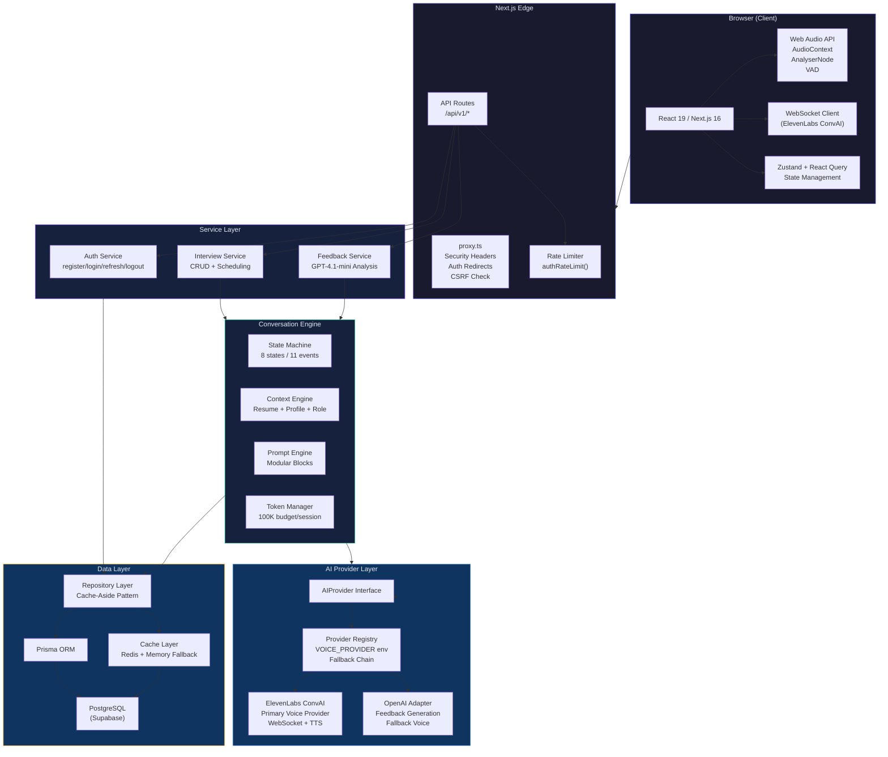

# System Architecture

## Key Components

| Layer | Technology | Purpose |
|-------|-----------|---------|
| **Frontend** | Next.js 16 + React 19 | App Router, Client/Server Components |
| **Audio** | Web Audio API | Shared AudioContext, AnalyserNodes, VAD |
| **Voice** | ElevenLabs ConvAI | Primary voice provider (WebSocket + GPT-4o) |
| **Auth** | JWT (jose) + bcrypt | httpOnly cookies, refresh rotation, SHA-256 |
| **Cache** | Redis + Memory | Cache-aside pattern, automatic fallback |
| **Database** | PostgreSQL (Supabase) | Prisma ORM, 5 models, cascade deletes |
| **Feedback** | GPT-4.1-mini | Transcript analysis, structured scoring |
| **Deployment** | Vercel | Edge functions, automatic scaling |
