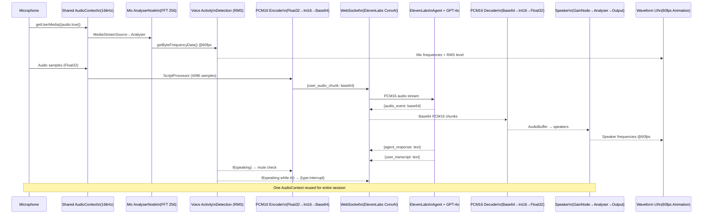

# Voice Pipeline Architecture

## Barge-In Flow

```mermaid
graph LR
    A[AI Speaking] -->|Local VAD detects speech| B[activateBargeIn]
    B --> C[bargeInUntil = now + 1000ms]
    C --> D[Stop AudioBufferSourceNode]
    D --> E[Mute GainNode to 0]
    E --> F[Send interrupt to ElevenLabs]
    F --> G[Discard all incoming audio]
    G --> H[Wait for new agent_response]
    H --> I[Clear bargeInUntil, restore gain]
    I --> J[Play new response]

    style B fill:#ef4444,color:#fff
    style G fill:#f59e0b,color:#000
    style J fill:#10b981,color:#fff
```

## Key Files

| File | Purpose |
|------|---------|
| `src/lib/audio/runtime.ts` | Shared AudioContext, AnalyserNodes, VAD, lifecycle |
| `src/hooks/use-audio-analyzer.ts` | React hook — 60fps subscription to runtime |
| `src/hooks/use-interview-session.ts` | WebSocket, audio capture/playback, barge-in |
| `src/components/features/interview/voice-interface.tsx` | Voice UI with waveforms, avatars, transcript |
