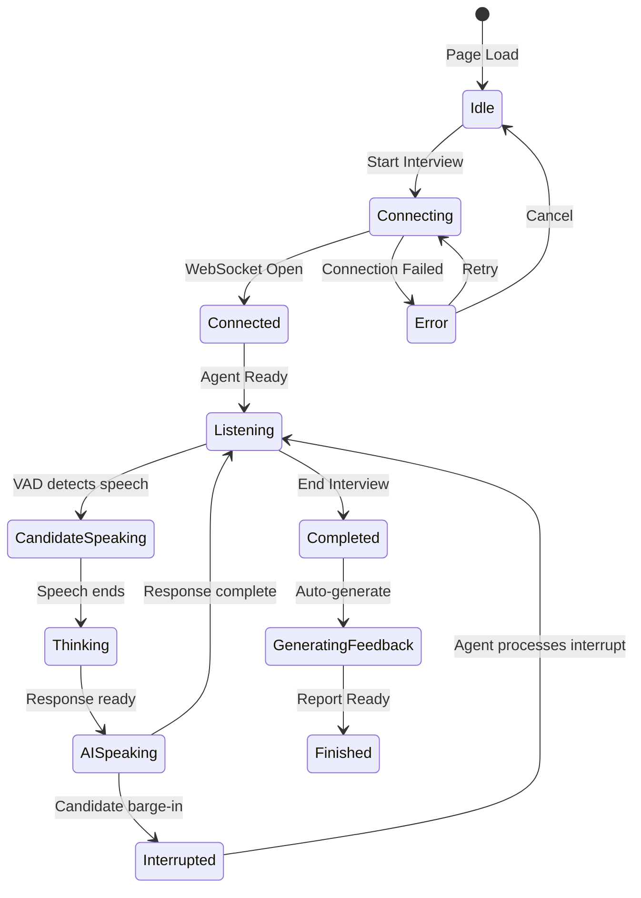

# Interview Lifecycle

## States

| State | Description |
|-------|-------------|
| **Idle** | Page loaded, waiting for user action |
| **Connecting** | Fetching signed URL, opening WebSocket |
| **Connected** | WebSocket established |
| **Listening** | Agent waiting for candidate input |
| **CandidateSpeaking** | Local VAD detects speech |
| **Thinking** | Agent processing response (GPT-4o) |
| **AISpeaking** | Agent streaming audio response |
| **Interrupted** | Candidate interrupted mid-response |
| **Completed** | User ended interview |
| **GeneratingFeedback** | GPT-4.1-mini analyzing transcript |
| **Finished** | Report available on dashboard |

## VAD Thresholds

| State | RMS Range | Action |
|-------|-----------|--------|
| Silence | < 0.015 | No action |
| Low | 0.015 - 0.06 | Visual only |
| Speaking | 0.06 - 0.10 | Transcript capture |
| Loud | > 0.25 | Barge-in trigger |
