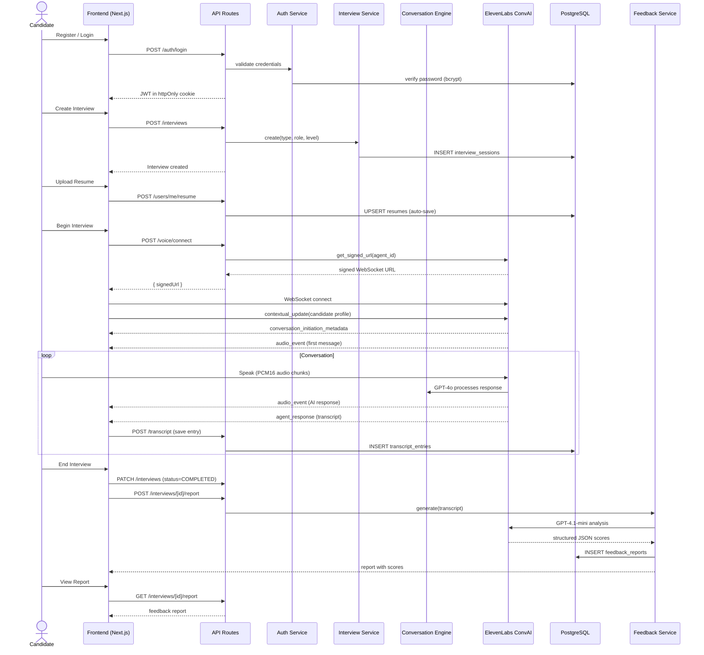

# End-to-End Interview Flow

## Key Events

| Step | Duration | Notes |
|------|----------|-------|
| Login → Dashboard | ~500ms | JWT verify + cookie set |
| Create Interview | ~200ms | DB insert |
| Voice Connect | ~700ms | ElevenLabs signed URL API |
| First Response | ~2s | Agent initial_wait_time 1s |
| Per-turn Latency | ~1-3s | GPT-4o processing time |
| Feedback Generation | ~5-15s | GPT-4.1-mini analysis |
