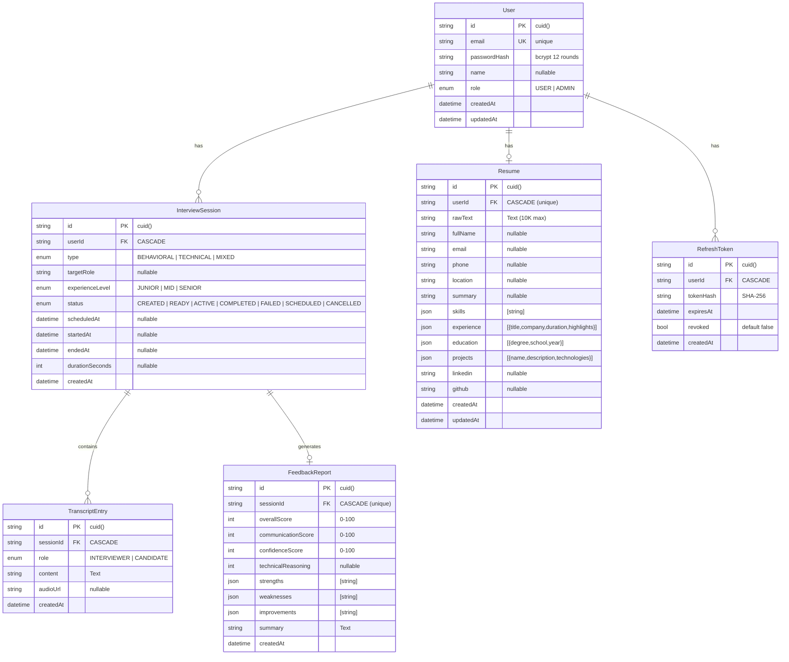

# Database Schema (Prisma)

## Indexes

| Table | Index | Type |
|-------|-------|------|
| interview_sessions | userId | B-tree |
| interview_sessions | status | B-tree |
| transcript_entries | sessionId | B-tree |
| transcript_entries | (sessionId, createdAt) | Composite |
| refresh_tokens | userId | B-tree |
| refresh_tokens | expiresAt | B-tree |

## Cache Strategy

| Entity | TTL | Invalidation |
|--------|-----|-------------|
| User | 15 min | On create/update/delete |
| Interview (single) | 1 hour | On status change |
| Interview (list) | 5 min | On create/status change |
| Resume | None | Always fresh (auto-save) |
| Token hashes | None | No caching (security) |
