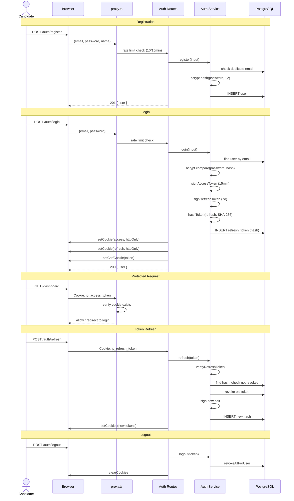

# Authentication Flow

## Security Layers

| Layer | Implementation |
|-------|---------------|
| Password | bcrypt (cost 12), min 8 chars |
| Access Token | JWT (HS256), 15min, httpOnly cookie |
| Refresh Token | JWT (HS256), 7d, httpOnly, SHA-256 hash stored |
| Rotation | Old token revoked on refresh, reuse detection |
| CSRF | Double-submit cookie (ip_csrf) + x-csrf-token header |
| Rate Limit | 10 req/15min per IP on auth endpoints |
| Proxy | Security headers, auth redirects |
