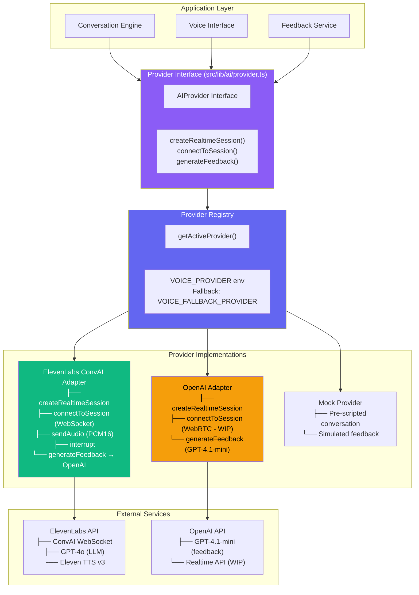

# AI Provider Architecture



## Provider Selection Logic

```
VOICE_PROVIDER=elevenlabs (default)
        ↓
   Try ElevenLabs
        ↓
   Success? → Use ElevenLabs
   Fail?    → Try VOICE_FALLBACK_PROVIDER
        ↓
   Fallback=openai? → Use OpenAI
   Fallback=mock?   → Use Mock
```

## Why Provider Abstraction?

- **Swap providers** by changing one env var — zero code changes
- **Fallback chain** ensures availability
- **Mock provider** enables development without API keys
- **Future providers** (Google, Anthropic) require only new adapter implementing `AIProvider`
