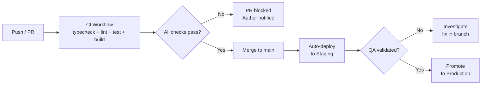

# Deployment

**Product:** InterviewPilot AI
**Document:** Deployment Guide
**Version:** 1.0
**Status:** Draft
**Owner:** Niranjan Sah

---

## 1. Overview

InterviewPilot AI is deployed on **Vercel** for the frontend and Next.js API routes, with **Supabase** for managed PostgreSQL. This document covers deployment procedures, environment configuration, and rollback procedures.

---

## 2. Environments

| Environment | URL | Purpose | Deploy Trigger |
|-------------|-----|---------|---------------|
| Development | localhost | Local development | Manual |
| Staging | staging.interviewpilot.ai | Pre-production testing | Push to `main` |
| Production | interviewpilot.ai | Live users | Manual promotion from staging |

---

## 3. CI/CD Pipeline

### GitHub Actions Workflows

| Workflow | Trigger | Purpose |
|----------|---------|---------|
| `ci.yml` | Every push/PR | Type check, lint, test, build |
| `release.yml` | Git tag `v*` | Create GitHub release + production deploy |

---

## 4. Environment Variables

### Required Variables

| Variable | Staging | Production | Description |
|----------|---------|------------|-------------|
| `DATABASE_URL` | ✅ | ✅ | Supabase PostgreSQL connection string |
| `JWT_SECRET` | ✅ | ✅ | HS256 signing secret (min 32 chars) |
| `JWT_REFRESH_SECRET` | ✅ | ✅ | Refresh token signing secret |
| `OPENAI_API_KEY` | ✅ | ✅ | OpenAI API key |
| `OPENAI_REALTIME_MODEL` | ✅ | ✅ | Realtime model identifier |
| `NEXT_PUBLIC_APP_URL` | ✅ | ✅ | Application URL (for CORS) |
| `NODE_ENV` | `staging` | `production` | Runtime environment |

### Vercel Setup

1. Go to **Vercel Dashboard** → Project → **Environment Variables**
2. Add each variable above for **Production** and **Staging** scopes
3. Redeploy affected deployments after changes

---

## 5. Database Migrations

Migrations run automatically during deployment via `prisma migrate deploy`.

**Important:**
- Never run `prisma migrate dev` in staging or production
- Always review generated SQL in `prisma/migrations/` before deploying
- Take a database snapshot before deploying migrations to production

See [docs/runbooks/database-migrations.md](../runbooks/database-migrations.md) for detailed procedures.

---

## 6. Deployment Procedures

### Deploy to Staging

Staging deploys automatically on every merge to `main`.

Manual redeploy:
1. Vercel Dashboard → Deployments
2. Find the latest deployment → **⋯** → **Redeploy**

### Deploy to Production

1. Confirm staging is stable and QA-approved
2. Vercel Dashboard → **Deployments** → latest staging deployment
3. Click **⋯** → **Promote to Production**

### Emergency Deployment

For urgent hotfixes:
1. Branch from the last production commit: `git checkout -b hotfix/description main~1`
2. Apply the fix
3. PR → review → merge to main
4. Follow the standard staging → production promotion

---

## 7. Rollback

### Application Rollback

Vercel keeps deployment history. To rollback:

1. Vercel Dashboard → **Deployments**
2. Find the last known good deployment
3. Click **⋯** → **Promote to Production**

This restores the previous deployment instantly with zero downtime.

### Database Rollback

Database rollbacks are **not** supported via migration reversal. Instead:

1. Restore from the pre-migration Supabase backup
2. Apply a new forward migration to fix the issue

See [docs/runbooks/database-migrations.md](../runbooks/database-migrations.md).

---

## 8. Health Checks

| Endpoint | Purpose |
|----------|---------|
| `GET /api/health` | Returns `200 OK` if the API is responding |

Vercel uses this endpoint for health verification.

---

## 9. Domain & DNS

| Domain | Provider | Type |
|--------|----------|------|
| interviewpilot.ai | Cloudflare | A record → Vercel |
| api.interviewpilot.ai | Cloudflare | CNAME → Vercel |

DNS changes propagate within 5-30 minutes.

---

## 10. Related Documents

- [docs/runbooks/incident-response.md](../runbooks/incident-response.md)
- [docs/runbooks/database-migrations.md](../runbooks/database-migrations.md)
- [12-OBSERVABILITY.md](12-OBSERVABILITY.md)
- [.github/workflows/](../.github/workflows/)
