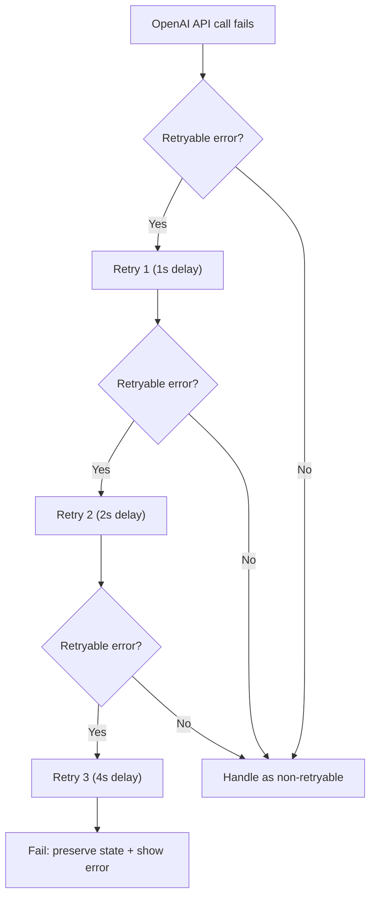

# Error Handling

**Product:** InterviewPilot AI
**Document:** Error Handling Strategy
**Version:** 1.0
**Status:** Draft
**Owner:** Niranjan Sah

---

## 1. Philosophy

Errors should be informative to developers debugging issues and actionable for users experiencing them. A user-facing error should never be a raw exception message. An internal error should always be logged with enough context to diagnose.

---

## 2. Error Taxonomy

### Client Errors (4xx)

These originate from invalid user input or unauthorized access. They return `4xx` status codes with structured JSON bodies.

| Status | Code | When |
|--------|------|------|
| 400 | `BAD_REQUEST` | Malformed request syntax |
| 401 | `UNAUTHORIZED` | Missing or invalid token |
| 403 | `FORBIDDEN` | Valid token but insufficient permissions |
| 404 | `NOT_FOUND` | Resource does not exist |
| 409 | `CONFLICT` | Email already exists, duplicate resource |
| 422 | `VALIDATION_ERROR` | Zod validation failed |
| 429 | `RATE_LIMITED` | Too many requests |

### Server Errors (5xx)

These are unexpected failures. They return `500` with a generic message to the client. Full details go to Sentry.

| Status | Code | When |
|--------|------|------|
| 500 | `INTERNAL_ERROR` | Unhandled exception |
| 502 | `BAD_GATEWAY` | External service (OpenAI/Supabase) failed |
| 503 | `SERVICE_UNAVAILABLE` | Temporary overload or maintenance |

---

## 3. Error Response Format

All API errors follow this structure:

```typescript
interface ApiError {
  detail: string;       // Human-readable message (safe to show users)
  code: string;         // Machine-readable error code
  field?: string;       // Which field failed (for validation errors)
  requestId?: string;   // For support to reference in logs
}
```

### Examples

**Validation error (422):**
```json
{
  "detail": "Invalid email format",
  "code": "VALIDATION_ERROR",
  "field": "email"
}
```

**Unauthorized (401):**
```json
{
  "detail": "Your session has expired. Please log in again.",
  "code": "TOKEN_EXPIRED",
  "requestId": "01HV..."
}
```

**Server error (500):**
```json
{
  "detail": "Something went wrong. Our team has been notified.",
  "code": "INTERNAL_ERROR",
  "requestId": "01HV..."
}
```

---

## 4. Implementation

### API Route Errors

```typescript
// src/lib/errors.ts
export class ApiError extends Error {
  constructor(
    public statusCode: number,
    public code: string,
    message: string,
    public field?: string
  ) {
    super(message);
    this.name = 'ApiError';
  }
}

// src/app/api/users/route.ts
export async function POST(req: Request) {
  try {
    const body = await req.json();
    const user = await userService.create(body);
    return Response.json(user, { status: 201 });
  } catch (err) {
    if (err instanceof ApiError) {
      return Response.json(
        { detail: err.message, code: err.code, field: err.field },
        { status: err.statusCode }
      );
    }
    // Log unexpected errors, re-throw for global handler
    console.error('Unexpected error in POST /api/users', err);
    throw err;
  }
}
```

### Global Error Handler

Next.js 16 Route Handlers do not have a global error handler like Express. Error handling is done per-route. For unhandled errors, the Vercel error boundary in `app/error.tsx` catches React tree errors.

---

## 5. Voice/AI Errors

### OpenAI Realtime API Errors

| Error | User Message | Action |
|-------|-------------|--------|
| `session.create failed` | "Could not start interview. Retrying…" | Retry 3x with exponential backoff |
| `response generation timeout` | "The AI is taking longer than expected…" | Retry once |
| `audio stream interrupted` | Silent reconnect, no user message | Auto-reconnect |
| `API key invalid` | Admin alert only | Log + alert engineering |

### Recovery Strategy



---

## 6. Frontend Error Handling

### API Error Display

The API client wraps all fetch calls and converts non-2xx responses into `ApiError` objects:

```typescript
// src/lib/api/client.ts
async function apiRequest<T>(url: string, options?: RequestInit): Promise<T> {
  const res = await fetch(url, {
    ...options,
    credentials: 'include',
  });

  if (!res.ok) {
    const body = await res.json().catch(() => ({}));
    throw new ApiError(res.status, body.code || 'UNKNOWN', body.detail || 'An error occurred');
  }

  return res.json();
}
```

### Error States in UI

| State | What to Show |
|-------|-------------|
| Network error | "Check your internet connection and try again." |
| 401 | Redirect to login with return URL |
| 422 | Inline field errors from `code: "VALIDATION_ERROR"` |
| 429 | "Too many requests. Please wait a moment." |
| 500 | "Something went wrong. Please try again." with retry button |

---

## 7. Logging Requirements

Every error logged must include:

```json
{
  "timestamp": "...",
  "level": "error",
  "requestId": "...",
  "userId": "uuid or null",
  "path": "/api/interviews",
  "method": "POST",
  "errorCode": "OPENAI_TIMEOUT",
  "message": "OpenAI API timeout after 30s",
  "stack": "..."
}
```

---

## 8. Related Documents

- [07-SECURITY.md](07-SECURITY.md)
- [12-OBSERVABILITY.md](12-OBSERVABILITY.md)
- [docs/runbooks/incident-response.md](../runbooks/incident-response.md)
