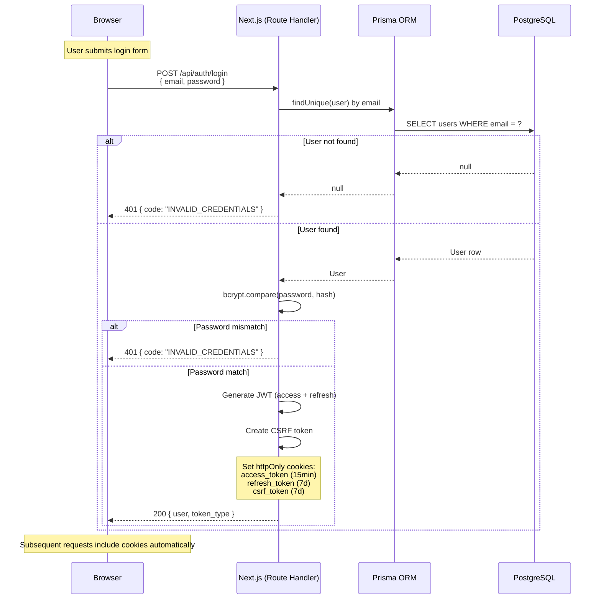
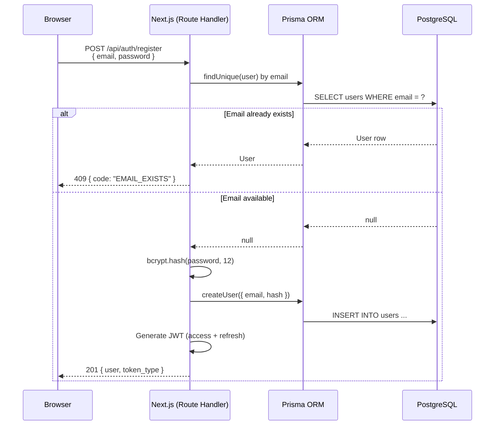
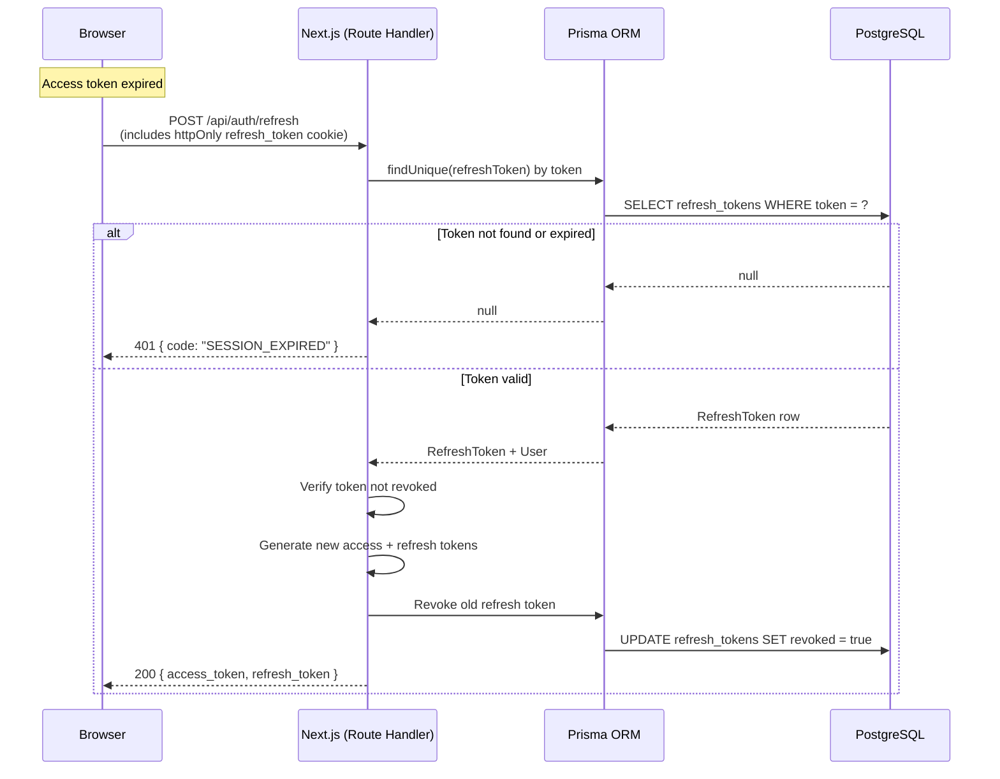
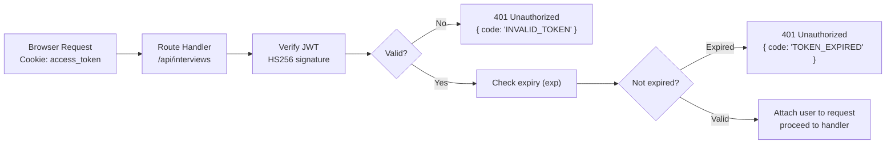

# Authentication Flow

---

## Registration Flow

---

## Token Refresh Flow

---

## JWT Verification on Protected Routes

---

## Security Measures Summary

| Threat | Mitigation |
|--------|-----------|
| XSS (cookie theft) | httpOnly cookies, no localStorage for tokens |
| CSRF | Double-submit cookie pattern with CSRF token |
| Brute force login | Rate limiting: 5 attempts / 15 min per IP |
| Token theft | Short-lived access tokens (15 min), refresh token rotation |
| Password storage | bcrypt cost factor 12, never stored plaintext |
| Privilege escalation | JWT scope validation on every request |
