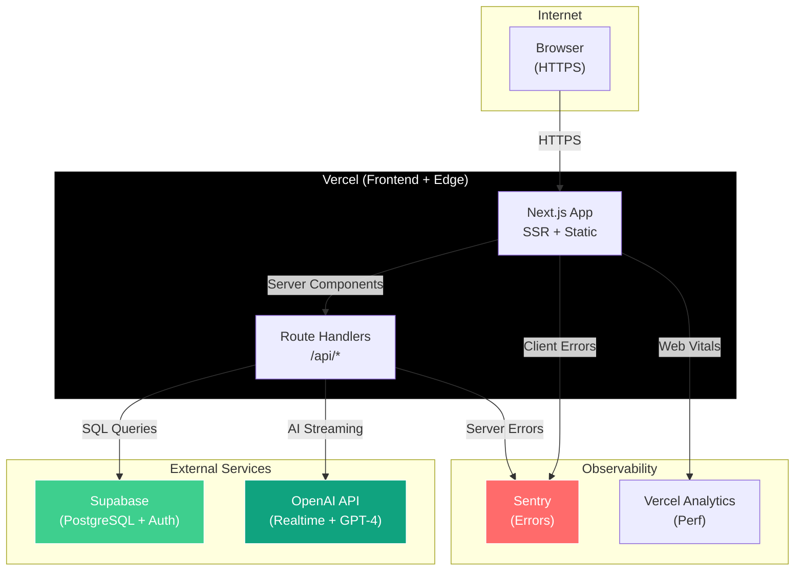
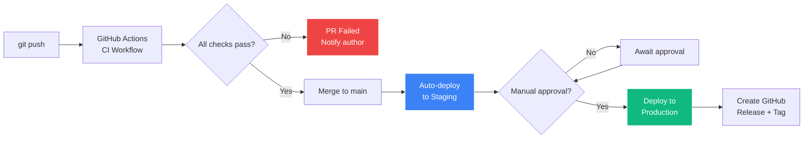
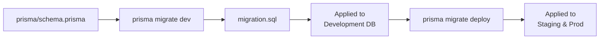
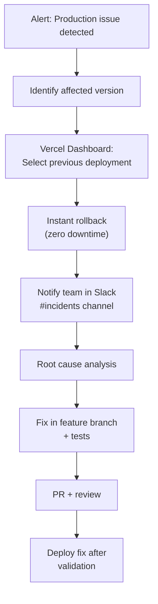

# Deployment Topology



---

## CI/CD Pipeline



---

## Environment Configuration

```mermaid
flowchart TD
    subgraph Development
        D1["localhost:3000"]
        D2[".env.local"]
    end

    subgraph Staging
        S1["staging.interviewpilot.ai"]
        S2["Vercel Environment<br/>Variables"]
    end

    subgraph Production
        P1["interviewpilot.ai"]
        P2["Vercel Environment<br/>Variables + Secrets"]
    end

    D2 -.->|"Same shape"| S2 -.->|"Same shape"| P2

    Note over D1,P1: All environments share the same Prisma schema and API contract
```

---

## Database Migration Strategy



---

## Rollback Procedure


