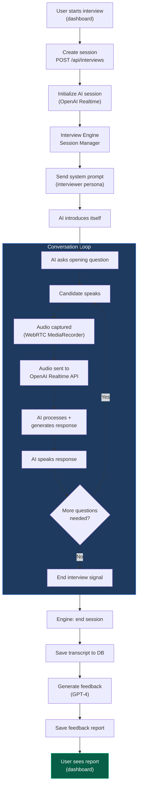
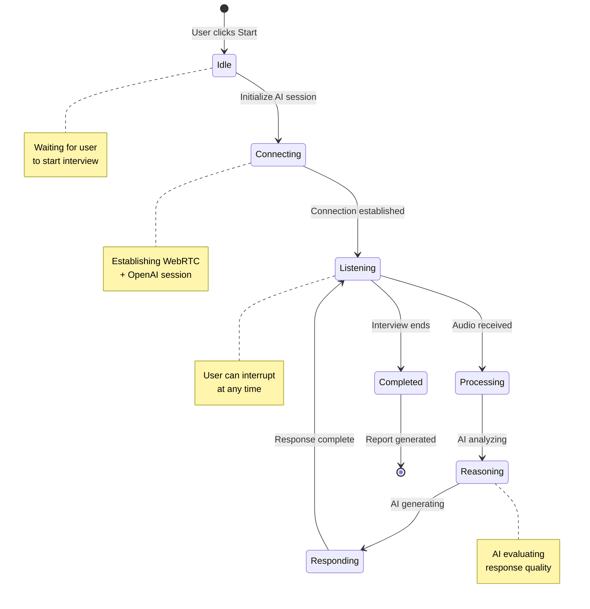
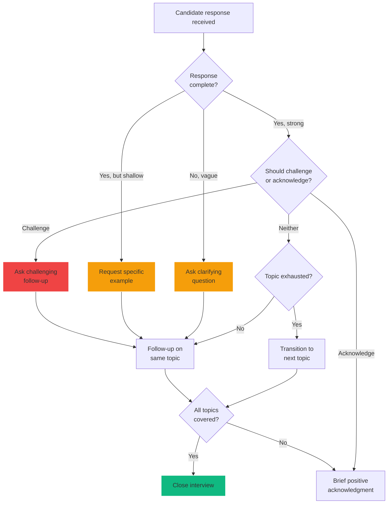
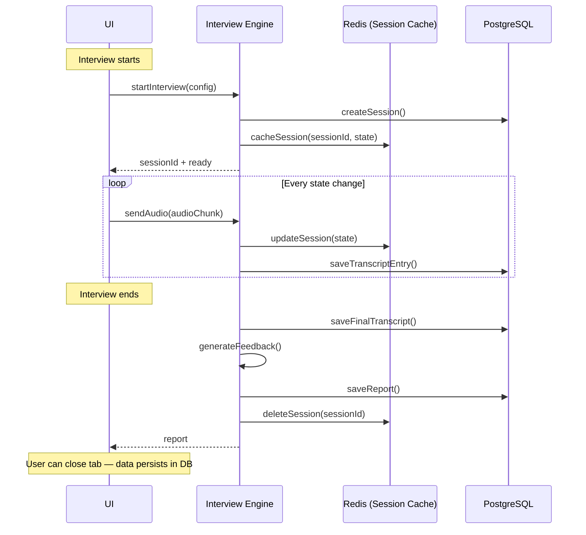

# Interview Engine Flow

```mermaid
flowchart TD
    A["User starts interview<br/>(dashboard)"] --> B["Create session<br/>POST /api/interviews"]
    B --> C["Initialize AI session<br/>(OpenAI Realtime)"]
    C --> D["Interview Engine<br/>Session Manager"]

    D --> E["Send system prompt<br/>(interviewer persona)"]
    E --> F["AI introduces itself"]

    F --> G["AI asks opening question"]

    subgraph Conversation["Conversation Loop"]
        G --> H["Candidate speaks"]
        H --> I["Audio captured<br/>(WebRTC MediaRecorder)"]
        I --> J["Audio sent to<br/>OpenAI Realtime API"]
        J --> K["AI processes +<br/>generates response"]
        K --> L["AI speaks response"]
        L --> M{"More questions<br/>needed?"}
        M -->|Yes| H
        M -->|No| N["End interview signal"]
    end

    N --> O["Engine: end session"]
    O --> P["Save transcript to DB"]
    P --> Q["Generate feedback<br/>(GPT-4)"]
    Q --> R["Save feedback report"]
    R --> S["User sees report<br/>(dashboard)"]

    style Conversation fill:#1E3A5F,stroke:#3B82F6,color:#fff
    style S fill:#065F46,stroke:#10B981,color:#fff
```

---

## Conversation State Machine

```mermaid
stateDiagram-v2
    [*] --> Idle: User clicks Start

    Idle --> Connecting: Initialize AI session
    Connecting --> Listening: Connection established

    Listening --> Processing: Audio received
    Processing --> Reasoning: AI analyzing
    Reasoning --> Responding: AI generating

    Responding --> Listening: Response complete
    Listening --> Completed: Interview ends

    Completed --> [*]: Report generated

    note right of Idle: Waiting for user<br/>to start interview
    note right of Connecting: Establishing WebRTC<br/>+ OpenAI session
    note right of Listening: User can interrupt<br/>at any time
    note right of Reasoning: AI evaluating<br/>response quality
```

---

## Follow-Up Decision Engine

```mermaid
flowchart TD
    A["Candidate response received"] --> B{"Response<br/>complete?"}

    B -->|No, vague| C["Ask clarifying<br/>question"]
    B -->|Yes, but shallow| D["Request specific<br/>example"]
    B -->|Yes, strong| E{"Should challenge<br/>or acknowledge?"}

    E -->|Challenge| F["Ask challenging<br/>follow-up"]
    E -->|Acknowledge| G["Brief positive<br/>acknowledgment"]
    E -->|Neither| H{"Topic exhausted?"}

    H -->|Yes| I["Transition to<br/>next topic"]
    H -->|No| J["Follow-up on<br/>same topic"]
    C --> J
    D --> J
    F --> J

    I --> K{"All topics<br/>covered?"}
    K -->|Yes| L["Close interview"]
    K -->|No| G
    J --> K

    style C fill:#F59E0B,stroke:#fff
    style D fill:#F59E0B,stroke:#fff
    style F fill:#EF4444,stroke:#fff
    style L fill:#10B981,stroke:#fff
```

---

## Session State Persistence

```mermaid
sequenceDiagram
    participant UI
    participant Engine as Interview Engine
    participant Redis as Redis (Session Cache)
    participant DB as PostgreSQL

    Note over UI: Interview starts
    UI->>Engine: startInterview(config)
    Engine->>DB: createSession()
    Engine->>Redis: cacheSession(sessionId, state)
    Engine-->>UI: sessionId + ready

    loop Every state change
        UI->>Engine: sendAudio(audioChunk)
        Engine->>Redis: updateSession(state)
        Engine->>DB: saveTranscriptEntry()
    end

    Note over UI: Interview ends
    Engine->>DB: saveFinalTranscript()
    Engine->>Engine: generateFeedback()
    Engine->>DB: saveReport()
    Engine->>Redis: deleteSession(sessionId)
    Engine-->>UI: report

    Note over UI: User can close tab — data persists in DB
```
