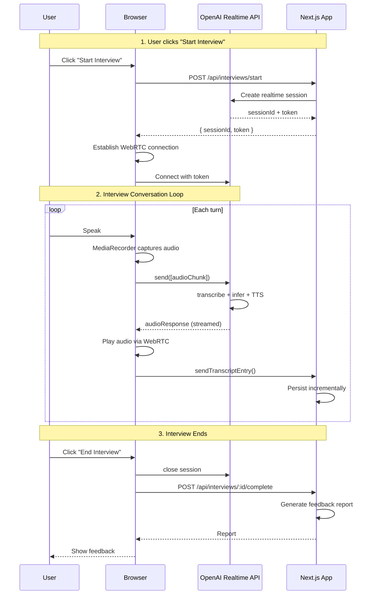
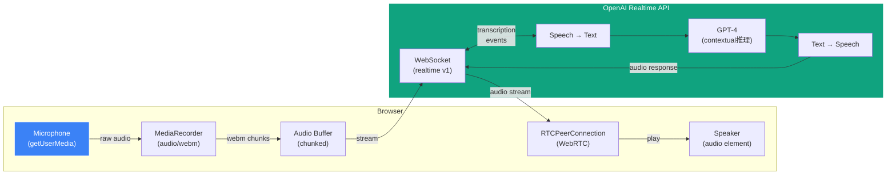

# Voice Conversation Flow

---

## WebRTC Audio Pipeline

---

## Audio State Timeline

```mermaid
gantt
    title Interview Audio State Over Time
    dateFormat X
    axisFormat %s

    section Idle
    Microphone inactive         :0, 0

    section Active
    Candidate speaking           :10, 25
    AI processing               :25, 30
    AI responding               :30, 45
    Candidate speaking          :45, 65
    AI processing               :65, 70
    AI responding               :70, 85
    Candidate speaking          :85, 100

    section States
    listening                   :10, 25
    processing                  :25, 30
    speaking                    :30, 45
    listening                   :45, 65
    processing                  :65, 70
    speaking                    :70, 85
    listening                   :85, 100
    completed                   :100, 100
```

---

## Voice Quality Optimizations

| Stage | Technique | Benefit |
|-------|-----------|---------|
| Capture | `audio/webm; codecs=opus` | Wide browser support, good compression |
| Chunking | 100ms chunks | Balance between latency and overhead |
| Buffering | Adaptive jitter buffer | Smooth audio despite network jitter |
| Playback | Pre-decode next chunk | Reduce gap between AI responses |
| Network | WebRTC FEC + NACK | Resilience against packet loss |

---

## Browser Compatibility

| Browser | Support | Notes |
|---------|---------|-------|
| Chrome 80+ | ✅ Full | Preferred platform |
| Edge 80+ | ✅ Full | Chromium-based, same as Chrome |
| Firefox 78+ | ✅ Full | Slightly higher latency |
| Safari 14+ | ⚠️ Partial | WebRTC support exists, some quirks |
| Mobile Safari | ⚠️ Partial | Background audio issues |
| Others | ❌ Unsupported | Graceful degradation message |
